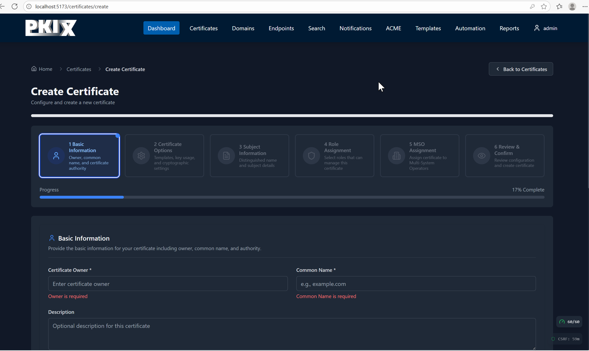
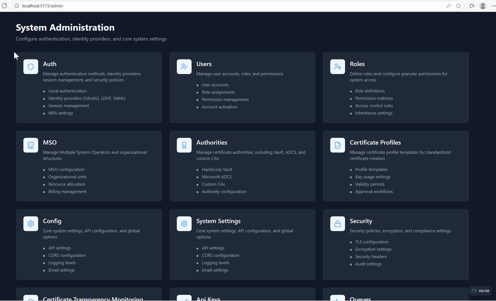
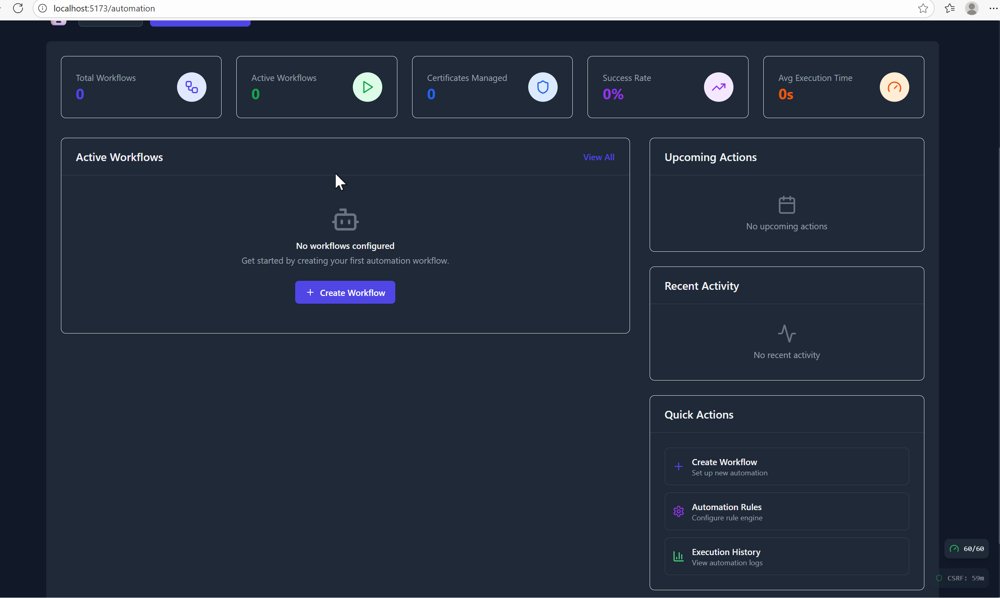
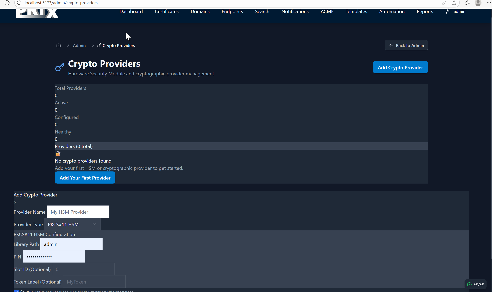
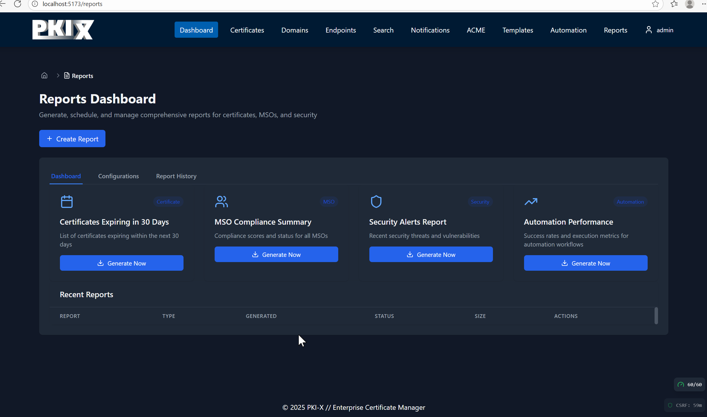
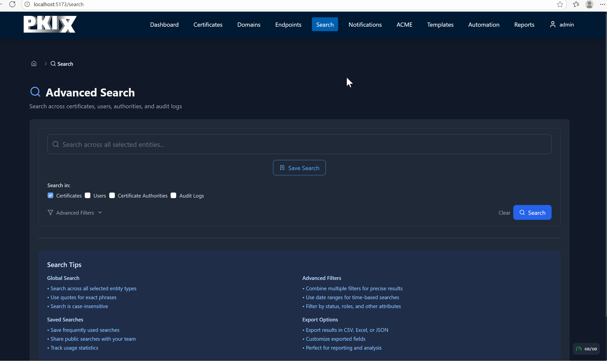
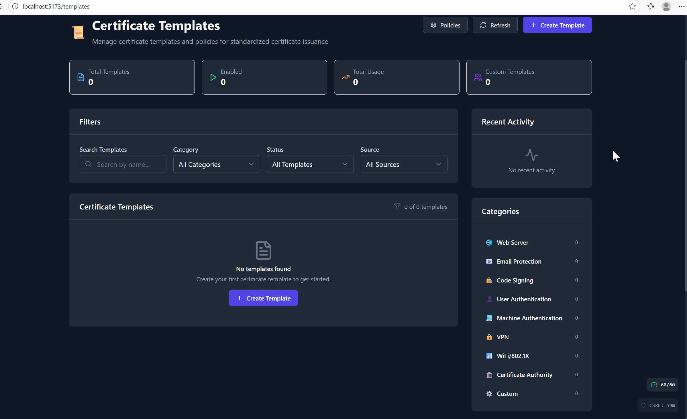

# PKI-X
Named after the PKI X.509 standards, PKI-X is a platform that helps you create certificates, deploy them, keep a close eye on them, and shepherd them through their lifecycle. 

PKI-X can orchestrate for both Private PKI and Public PKI! 

* From short lived ACME to regular one year certificates.
* Post Quantum to traditional. 
* HSM and Cloud HSM support.
* Many public CA's, Cloud platforms and self contained certificate sources
* Many DNS providers.
* Many Automation frameworks, including built in.
* MFA!
* Audit logging!
* Security Posture and discovery!
* Agent and Agentless monitoring!
* Easy deployment of certificates!
* So many more features!!

This platform is in deep, heavy development and will be shared on github soon.

## Preview images

[back](./)
